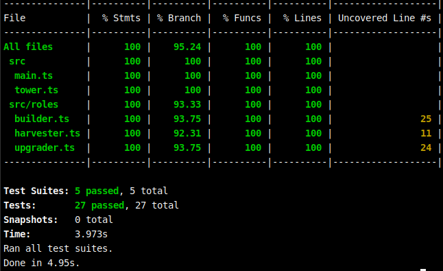

# Screeps Typescript + Jest Starter

The goal of this fork is to demonstrate how to unit test your [Screeps](https://screeps.com/) bot with [Jest](https://jestjs.io/), and to serve as a starting point for those who want to do the same.

For anything else, go to [the original repository](https://github.com/screepers/screeps-typescript-starter).

